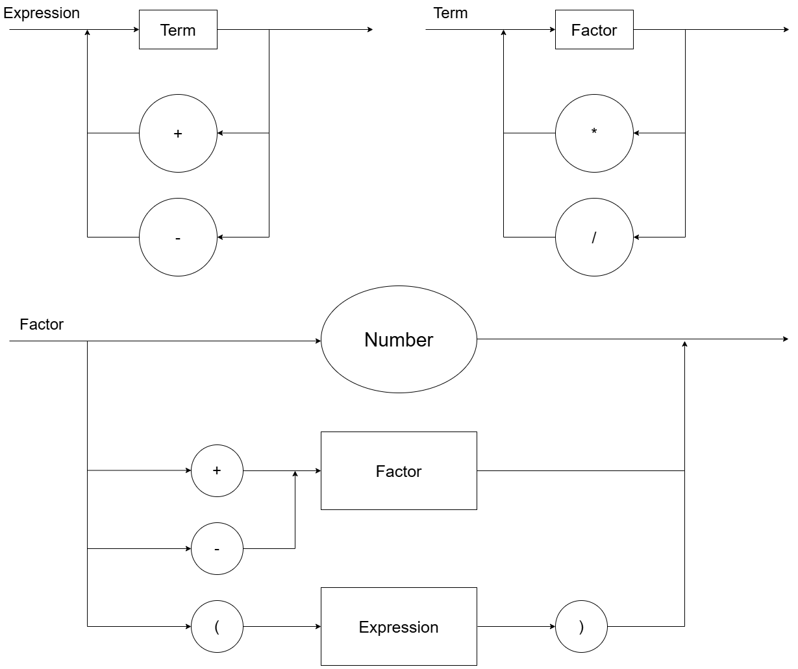

# LogCompGESO
Repositório da disciplina de Logica Computacional do Insper


Diagrama sintático do compilador:



Representação EBNF do compilador:
```ebnf
<expression> ::= <term> { ("+" | "-") <term> };

<term> ::= <factor> { ("*" | "/") <factor> };

<factor> ::= <unary_operator> <factor> | "(" <expression> ")" | <number>;

<unary_operator> ::= "+" | "-";

<number> ::= <digit> { <digit> };

<digit> ::= "-2^63 | ... | 2^63";
```
