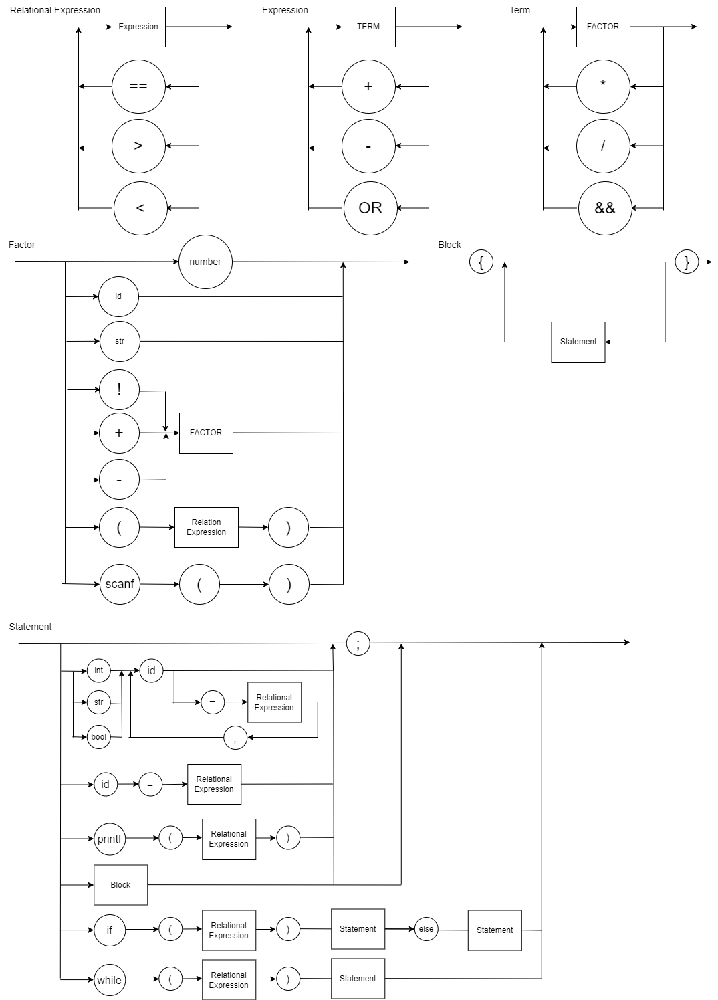

# LogCompGESO
Repositório da disciplina de Logica Computacional do Insper


Diagrama sintático do compilador:



Representação EBNF do compilador:
```ebnf
BLOCK = "{", { STATEMENT }, "}" ;

STATEMENT = ( λ | ASSIGNMENT | PRINT | INPUT | IF | WHILE | BLOCK ), ";" ;

ASSIGNMENT = IDENTIFIER, "=", EXPRESSION ;

PRINT = "printf", "(", EXPRESSION, ")" ;

INPUT = "scanf", "(", IDENTIFIER, ")" ;

IF = "if", "(", BOOLEAN_EXPRESSION, ")", BLOCK, [ "else", BLOCK ] ;

WHILE = "while", "(", BOOLEAN_EXPRESSION, ")", BLOCK ;

EXPRESSION = TERM, { ("+" | "-"), TERM } ;

TERM = FACTOR, { ("*" | "/"), FACTOR } ;

FACTOR = (("+" | "-" | "!"), FACTOR) | NUMBER | "(", EXPRESSION, ")" | IDENTIFIER ;

BOOLEAN_EXPRESSION = RELATIONAL_EXPRESSION, { ("&&" | "||"), RELATIONAL_EXPRESSION } ;

RELATIONAL_EXPRESSION = EXPRESSION, [ ("==" | ">" | "<"), EXPRESSION ] ;

IDENTIFIER = LETTER, { LETTER | DIGIT | "_" } ;

NUMBER = DIGIT, { DIGIT } ;

LETTER = ( a | ... | z | A | ... | Z ) ;

DIGIT = ( 0 | 1 | 2 | 3 | 4 | 5 | 6 | 7 | 8 | 9 ) ;

```
